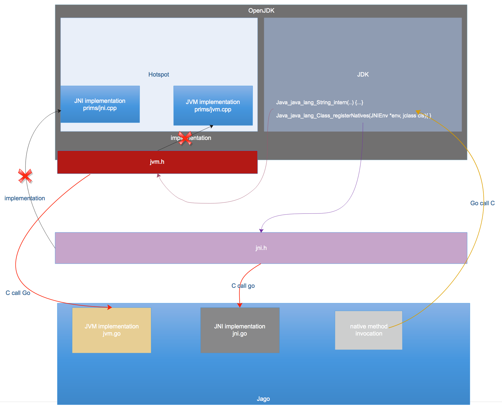

# Jago

A simple Java interpreter written with Go language. This project is to learn JVM specification in depth and try to understand the
under-the-water mechanism when a Java program runs.

Basically, I only refer to "Java Virtual Machine Specification" and then compose how we should design one. 
I have to say many implementation details are naive and I make it as simplified as possible so as to
demonstrate the idea. For the educational purpose, it is enough.

# Roadmap

- Java class parser
- Interpreter
- Bridge JNI native method
- NO GC
- NO JIT
- NO multi-thread support

# JDK solution



# Details

## example tracing classloading and bytecode execution

```
	FDFD
豊
[I@1a=

  ‧‧‧‧‧‧‧‧‧‧‧‧‧‧‧‧‧‧‧‧‧‧‧‧‧‧‧‧‧‧‧‧‧‧‧‧‧‧‧‧‧‧‧‧‧‧‧‧
  ↳ Main 
    ‧‧‧‧‧‧‧‧‧‧‧‧‧‧‧‧‧‧‧‧‧‧‧‧‧‧‧‧‧‧‧‧‧‧‧‧‧‧‧‧‧‧‧‧‧‧
    ↳ java/lang/Object 
      ‧‧‧‧‧‧‧‧‧‧‧‧‧‧‧‧‧‧‧‧‧‧‧‧‧‧‧‧‧‧‧‧‧‧‧‧‧‧‧‧‧‧‧‧
      ↳ java/lang/Class 
        ‧‧‧‧‧‧‧‧‧‧‧‧‧‧‧‧‧‧‧‧‧‧‧‧‧‧‧‧‧‧‧‧‧‧‧‧‧‧‧‧‧‧
        ↳ java/io/Serializable 
        ↱ java/io/Serializable 
        ‧‧‧‧‧‧‧‧‧‧‧‧‧‧‧‧‧‧‧‧‧‧‧‧‧‧‧‧‧‧‧‧‧‧‧‧‧‧‧‧‧‧
        ‧‧‧‧‧‧‧‧‧‧‧‧‧‧‧‧‧‧‧‧‧‧‧‧‧‧‧‧‧‧‧‧‧‧‧‧‧‧‧‧‧‧
        ↳ java/lang/reflect/GenericDeclaration 
          ‧‧‧‧‧‧‧‧‧‧‧‧‧‧‧‧‧‧‧‧‧‧‧‧‧‧‧‧‧‧‧‧‧‧‧‧‧‧‧‧
          ↳ java/lang/reflect/AnnotatedElement 
          ↱ java/lang/reflect/AnnotatedElement 
          ‧‧‧‧‧‧‧‧‧‧‧‧‧‧‧‧‧‧‧‧‧‧‧‧‧‧‧‧‧‧‧‧‧‧‧‧‧‧‧‧
        ↱ java/lang/reflect/GenericDeclaration 
        ‧‧‧‧‧‧‧‧‧‧‧‧‧‧‧‧‧‧‧‧‧‧‧‧‧‧‧‧‧‧‧‧‧‧‧‧‧‧‧‧‧‧
        ‧‧‧‧‧‧‧‧‧‧‧‧‧‧‧‧‧‧‧‧‧‧‧‧‧‧‧‧‧‧‧‧‧‧‧‧‧‧‧‧‧‧
        ↳ java/lang/reflect/Type 
        ↱ java/lang/reflect/Type 
        ‧‧‧‧‧‧‧‧‧‧‧‧‧‧‧‧‧‧‧‧‧‧‧‧‧‧‧‧‧‧‧‧‧‧‧‧‧‧‧‧‧‧
      ↱ java/lang/Class 
      ‧‧‧‧‧‧‧‧‧‧‧‧‧‧‧‧‧‧‧‧‧‧‧‧‧‧‧‧‧‧‧‧‧‧‧‧‧‧‧‧‧‧‧‧
    ↱ java/lang/Object 
    ‧‧‧‧‧‧‧‧‧‧‧‧‧‧‧‧‧‧‧‧‧‧‧‧‧‧‧‧‧‧‧‧‧‧‧‧‧‧‧‧‧‧‧‧‧‧
  ↱ Main 
  ‧‧‧‧‧‧‧‧‧‧‧‧‧‧‧‧‧‧‧‧‧‧‧‧‧‧‧‧‧‧‧‧‧‧‧‧‧‧‧‧‧‧‧‧‧‧‧‧
🍷 Main.<clinit>()V 
   0000 ➢ iconst_2          
   0001 ➢ putstatic         	#22
   0004 ➢ return            
🍷 java/lang/Object.<clinit>()V 
   0000 ➢ invokestatic      	#16
🍺 invoke native method java/lang/Object.registerNatives()V
   0003 ➢ return            
🍷 Main.main([Ljava/lang/String;)V 
   0000 ➢ iconst_2          
   0001 ➢ istore_1          
   0002 ➢ iconst_2          
   0003 ➢ istore_2          
   0004 ➢ iload_1           
   0005 ➢ iload_2           
   0006 ➢ iadd              
   0007 ➢ istore_3          
   0008 ➢ iload_3           
   0009 ➢ invokestatic      	#2
🍷 Main.increase(I)I 
   0000 ➢ iload_0           
   0001 ➢ iconst_1          
   0002 ➢ iadd              
   0003 ➢ ireturn           
🍷 Main.main([Ljava/lang/String;)V 
   0012 ➢ istore            	#4
   0014 ➢ new               	#3
  ‧‧‧‧‧‧‧‧‧‧‧‧‧‧‧‧‧‧‧‧‧‧‧‧‧‧‧‧‧‧‧‧‧‧‧‧‧‧‧‧‧‧‧‧‧‧‧‧
  ↳ B 
    ‧‧‧‧‧‧‧‧‧‧‧‧‧‧‧‧‧‧‧‧‧‧‧‧‧‧‧‧‧‧‧‧‧‧‧‧‧‧‧‧‧‧‧‧‧‧
    ↳ A 
    ↱ A 
    ‧‧‧‧‧‧‧‧‧‧‧‧‧‧‧‧‧‧‧‧‧‧‧‧‧‧‧‧‧‧‧‧‧‧‧‧‧‧‧‧‧‧‧‧‧‧
  ↱ B 
  ‧‧‧‧‧‧‧‧‧‧‧‧‧‧‧‧‧‧‧‧‧‧‧‧‧‧‧‧‧‧‧‧‧‧‧‧‧‧‧‧‧‧‧‧‧‧‧‧

   0017 ➢ dup               
   0018 ➢ invokespecial     	#4
🍷 B.<init>()V 
   0000 ➢ aload_0           
   0001 ➢ invokespecial     	#1
🍷 A.<init>()V 
   0000 ➢ aload_0           
   0001 ➢ invokespecial     	#1
🍷 java/lang/Object.<init>()V 
   0000 ➢ return            
🍷 A.<init>()V 
   0004 ➢ return            
🍷 B.<init>()V 
   0004 ➢ return            
🍷 Main.main([Ljava/lang/String;)V 
   0021 ➢ astore            	#5
   0023 ➢ iconst_1          
   0024 ➢ putstatic         	#5
   0027 ➢ aload             	#5
   0029 ➢ iconst_2          
   0030 ➢ putfield          	#6
   0033 ➢ aload             	#5
   0035 ➢ iconst_3          
   0036 ➢ putfield          	#7
   0039 ➢ aload             	#5
   0041 ➢ invokevirtual     	#8
🍷 B.foo()V 
   0000 ➢ aload_0           
   0001 ➢ getfield          	#2
   0004 ➢ istore_1          
   0005 ➢ getstatic         	#3
   0008 ➢ istore_2          
   0009 ➢ return            
🍷 Main.main([Ljava/lang/String;)V 
   0044 ➢ iload_1           
   0045 ➢ i2d               
   0046 ➢ ldc2_w            	#9
   0049 ➢ ddiv              
   0050 ➢ dstore            	#6
   0052 ➢ new               	#11
  ‧‧‧‧‧‧‧‧‧‧‧‧‧‧‧‧‧‧‧‧‧‧‧‧‧‧‧‧‧‧‧‧‧‧‧‧‧‧‧‧‧‧‧‧‧‧‧‧
  ↳ GVM 
  ↱ GVM 
  ‧‧‧‧‧‧‧‧‧‧‧‧‧‧‧‧‧‧‧‧‧‧‧‧‧‧‧‧‧‧‧‧‧‧‧‧‧‧‧‧‧‧‧‧‧‧‧‧

   0055 ➢ dup               
   0056 ➢ invokespecial     	#12
🍷 GVM.<init>()V 
   0000 ➢ aload_0           
   0001 ➢ invokespecial     	#1
🍷 java/lang/Object.<init>()V 
   0000 ➢ return            
🍷 GVM.<init>()V 
   0004 ➢ return            
🍷 Main.main([Ljava/lang/String;)V 
   0059 ➢ astore            	#8
   0061 ➢ aload             	#8
   0063 ➢ ldc               	#13
  ‧‧‧‧‧‧‧‧‧‧‧‧‧‧‧‧‧‧‧‧‧‧‧‧‧‧‧‧‧‧‧‧‧‧‧‧‧‧‧‧‧‧‧‧‧‧‧‧
  ↳ java/lang/String 
    ‧‧‧‧‧‧‧‧‧‧‧‧‧‧‧‧‧‧‧‧‧‧‧‧‧‧‧‧‧‧‧‧‧‧‧‧‧‧‧‧‧‧‧‧‧‧
    ↳ java/lang/Comparable 
    ↱ java/lang/Comparable 
    ‧‧‧‧‧‧‧‧‧‧‧‧‧‧‧‧‧‧‧‧‧‧‧‧‧‧‧‧‧‧‧‧‧‧‧‧‧‧‧‧‧‧‧‧‧‧
    ‧‧‧‧‧‧‧‧‧‧‧‧‧‧‧‧‧‧‧‧‧‧‧‧‧‧‧‧‧‧‧‧‧‧‧‧‧‧‧‧‧‧‧‧‧‧
    ↳ java/lang/CharSequence 
    ↱ java/lang/CharSequence 
    ‧‧‧‧‧‧‧‧‧‧‧‧‧‧‧‧‧‧‧‧‧‧‧‧‧‧‧‧‧‧‧‧‧‧‧‧‧‧‧‧‧‧‧‧‧‧
  ↱ java/lang/String 
  ‧‧‧‧‧‧‧‧‧‧‧‧‧‧‧‧‧‧‧‧‧‧‧‧‧‧‧‧‧‧‧‧‧‧‧‧‧‧‧‧‧‧‧‧‧‧‧‧

  ‧‧‧‧‧‧‧‧‧‧‧‧‧‧‧‧‧‧‧‧‧‧‧‧‧‧‧‧‧‧‧‧‧‧‧‧‧‧‧‧‧‧‧‧‧‧‧‧
  ↳ [C 
    ‧‧‧‧‧‧‧‧‧‧‧‧‧‧‧‧‧‧‧‧‧‧‧‧‧‧‧‧‧‧‧‧‧‧‧‧‧‧‧‧‧‧‧‧‧‧
    ↳ java/lang/Cloneable 
    ↱ java/lang/Cloneable 
    ‧‧‧‧‧‧‧‧‧‧‧‧‧‧‧‧‧‧‧‧‧‧‧‧‧‧‧‧‧‧‧‧‧‧‧‧‧‧‧‧‧‧‧‧‧‧
  ↱ [C 
  ‧‧‧‧‧‧‧‧‧‧‧‧‧‧‧‧‧‧‧‧‧‧‧‧‧‧‧‧‧‧‧‧‧‧‧‧‧‧‧‧‧‧‧‧‧‧‧‧

   0065 ➢ invokestatic      	#14
🍷 GVM.<clinit>()V 
   0000 ➢ bipush            	90
   0002 ➢ putstatic         	#4
   0005 ➢ return            
🍷 Main.main([Ljava/lang/String;)V 
   0065 ➢ invokestatic      	#14
🍺 invoke native method GVM.toUpper(Ljava/lang/String;)Ljava/lang/String;
   0068 ➢ invokevirtual     	#15
🍷 GVM.println(Ljava/lang/Object;)V 
   0000 ➢ aload_0           
   0001 ➢ aload_1           
   0002 ➢ invokestatic      	#2
🍷 java/lang/String.<clinit>()V 
   0000 ➢ iconst_0          
   0001 ➢ anewarray         	#143
  ‧‧‧‧‧‧‧‧‧‧‧‧‧‧‧‧‧‧‧‧‧‧‧‧‧‧‧‧‧‧‧‧‧‧‧‧‧‧‧‧‧‧‧‧‧‧‧‧
  ↳ java/io/ObjectStreamField 
  ↱ java/io/ObjectStreamField 
  ‧‧‧‧‧‧‧‧‧‧‧‧‧‧‧‧‧‧‧‧‧‧‧‧‧‧‧‧‧‧‧‧‧‧‧‧‧‧‧‧‧‧‧‧‧‧‧‧

  ‧‧‧‧‧‧‧‧‧‧‧‧‧‧‧‧‧‧‧‧‧‧‧‧‧‧‧‧‧‧‧‧‧‧‧‧‧‧‧‧‧‧‧‧‧‧‧‧
  ↳ [Ljava/io/ObjectStreamField; 
  ↱ [Ljava/io/ObjectStreamField; 
  ‧‧‧‧‧‧‧‧‧‧‧‧‧‧‧‧‧‧‧‧‧‧‧‧‧‧‧‧‧‧‧‧‧‧‧‧‧‧‧‧‧‧‧‧‧‧‧‧

   0004 ➢ putstatic         	#144
   0007 ➢ new               	#145
  ‧‧‧‧‧‧‧‧‧‧‧‧‧‧‧‧‧‧‧‧‧‧‧‧‧‧‧‧‧‧‧‧‧‧‧‧‧‧‧‧‧‧‧‧‧‧‧‧
  ↳ java/lang/String$CaseInsensitiveComparator 
    ‧‧‧‧‧‧‧‧‧‧‧‧‧‧‧‧‧‧‧‧‧‧‧‧‧‧‧‧‧‧‧‧‧‧‧‧‧‧‧‧‧‧‧‧‧‧
    ↳ java/util/Comparator 
    ↱ java/util/Comparator 
    ‧‧‧‧‧‧‧‧‧‧‧‧‧‧‧‧‧‧‧‧‧‧‧‧‧‧‧‧‧‧‧‧‧‧‧‧‧‧‧‧‧‧‧‧‧‧
  ↱ java/lang/String$CaseInsensitiveComparator 
  ‧‧‧‧‧‧‧‧‧‧‧‧‧‧‧‧‧‧‧‧‧‧‧‧‧‧‧‧‧‧‧‧‧‧‧‧‧‧‧‧‧‧‧‧‧‧‧‧

   0010 ➢ dup               
   0011 ➢ aconst_null       
   0012 ➢ invokespecial     	#146
🍷 java/lang/String$CaseInsensitiveComparator.<init>(Ljava/lang/String$1;)V 
   0000 ➢ aload_0           
   0001 ➢ invokespecial     	#1
🍷 java/lang/String$CaseInsensitiveComparator.<init>()V 
   0000 ➢ aload_0           
   0001 ➢ invokespecial     	#2
🍷 java/lang/Object.<init>()V 
   0000 ➢ return            
🍷 java/lang/String$CaseInsensitiveComparator.<init>()V 
   0004 ➢ return            
🍷 java/lang/String$CaseInsensitiveComparator.<init>(Ljava/lang/String$1;)V 
   0004 ➢ return            
🍷 java/lang/String.<clinit>()V 
   0015 ➢ putstatic         	#55
   0018 ➢ return            
🍷 GVM.println(Ljava/lang/Object;)V 
   0002 ➢ invokestatic      	#2
🍷 java/lang/String.valueOf(Ljava/lang/Object;)Ljava/lang/String; 
   0000 ➢ aload_0           
   0001 ➢ ifnonnull         	⤋9
   0009 ➢ aload_0           
   0010 ➢ invokevirtual     	#135
🍷 java/lang/String.toString()Ljava/lang/String; 
   0000 ➢ aload_0           
   0001 ➢ areturn           
🍷 java/lang/String.valueOf(Ljava/lang/Object;)Ljava/lang/String; 
   0013 ➢ areturn           
🍷 GVM.println(Ljava/lang/Object;)V 
   0005 ➢ invokespecial     	#3
🍺 invoke native method GVM.println(Ljava/lang/String;)V
   0008 ➢ return            
🍷 Main.main([Ljava/lang/String;)V 
   0071 ➢ bipush            	10
   0073 ➢ anewarray         	#16
  ‧‧‧‧‧‧‧‧‧‧‧‧‧‧‧‧‧‧‧‧‧‧‧‧‧‧‧‧‧‧‧‧‧‧‧‧‧‧‧‧‧‧‧‧‧‧‧‧
  ↳ C 
  ↱ C 
  ‧‧‧‧‧‧‧‧‧‧‧‧‧‧‧‧‧‧‧‧‧‧‧‧‧‧‧‧‧‧‧‧‧‧‧‧‧‧‧‧‧‧‧‧‧‧‧‧

  ‧‧‧‧‧‧‧‧‧‧‧‧‧‧‧‧‧‧‧‧‧‧‧‧‧‧‧‧‧‧‧‧‧‧‧‧‧‧‧‧‧‧‧‧‧‧‧‧
  ↳ [LC; 
  ↱ [LC; 
  ‧‧‧‧‧‧‧‧‧‧‧‧‧‧‧‧‧‧‧‧‧‧‧‧‧‧‧‧‧‧‧‧‧‧‧‧‧‧‧‧‧‧‧‧‧‧‧‧

   0076 ➢ astore            	#9
   0078 ➢ ldc               	#17
   0080 ➢ istore            	#10
   0082 ➢ iload             	#10
   0084 ➢ i2c               
   0085 ➢ istore            	#11
   0087 ➢ aload             	#8
   0089 ➢ iload             	#11
   0091 ➢ invokestatic      	#18
  ‧‧‧‧‧‧‧‧‧‧‧‧‧‧‧‧‧‧‧‧‧‧‧‧‧‧‧‧‧‧‧‧‧‧‧‧‧‧‧‧‧‧‧‧‧‧‧‧
  ↳ java/lang/Character 
  ↱ java/lang/Character 
  ‧‧‧‧‧‧‧‧‧‧‧‧‧‧‧‧‧‧‧‧‧‧‧‧‧‧‧‧‧‧‧‧‧‧‧‧‧‧‧‧‧‧‧‧‧‧‧‧

🍷 java/lang/Character.<clinit>()V 
   0000 ➢ ldc               	#1
   0002 ➢ invokevirtual     	#102
🍷 java/lang/Class.desiredAssertionStatus()Z 
   0000 ➢ aload_0           
   0001 ➢ invokevirtual     	#257
🍷 java/lang/Class.getClassLoader()Ljava/lang/ClassLoader; 
   0000 ➢ aload_0           
   0001 ➢ invokevirtual     	#67
🍷 java/lang/Class.getClassLoader0()Ljava/lang/ClassLoader; 
   0000 ➢ aload_0           
   0001 ➢ getfield          	#10
   0004 ➢ areturn           
🍷 java/lang/Class.getClassLoader()Ljava/lang/ClassLoader; 
   0004 ➢ astore_1          
   0005 ➢ aload_1           
   0006 ➢ ifnonnull         	⤋11
   0009 ➢ aconst_null       
   0010 ➢ areturn           
🍷 java/lang/Class.desiredAssertionStatus()Z 
   0004 ➢ astore_1          
   0005 ➢ aload_1           
   0006 ➢ ifnonnull         	⤋14
   0009 ➢ aload_0           
   0010 ➢ invokestatic      	#258
🍷 java/lang/Class.<clinit>()V 
   0000 ➢ invokestatic      	#330
🍺 invoke native method java/lang/Class.registerNatives()V
   0003 ➢ iconst_1          
   0004 ➢ putstatic         	#2
   0007 ➢ iconst_0          
   0008 ➢ anewarray         	#331
   0011 ➢ putstatic         	#332
   0014 ➢ iconst_0          
   0015 ➢ putstatic         	#1
   0018 ➢ return            
🍷 java/lang/Class.desiredAssertionStatus()Z 
   0010 ➢ invokestatic      	#258
🍺 invoke native method java/lang/Class.desiredAssertionStatus0(Ljava/lang/Class;)Z
   0013 ➢ ireturn           
🍷 java/lang/Character.<clinit>()V 
   0005 ➢ ifne              	⤋12
   0012 ➢ iconst_0          
   0013 ➢ putstatic         	#83
   0016 ➢ ldc               	#103
   0018 ➢ invokestatic      	#104
🍺 invoke native method java/lang/Class.getPrimitiveClass(Ljava/lang/String;)Ljava/lang/Class;
   0021 ➢ putstatic         	#105
   0024 ➢ return            
🍷 Main.main([Ljava/lang/String;)V 
   0091 ➢ invokestatic      	#18
🍷 java/lang/Character.valueOf(C)Ljava/lang/Character; 
   0000 ➢ iload_0           
   0001 ➢ bipush            	127
   0003 ➢ if_icmpgt         	⤋12
   0012 ➢ new               	#1
   0015 ➢ dup               
   0016 ➢ iload_0           
   0017 ➢ invokespecial     	#6
🍷 java/lang/Character.<init>(C)V 
   0000 ➢ aload_0           
   0001 ➢ invokespecial     	#3
🍷 java/lang/Object.<init>()V 
   0000 ➢ return            
🍷 java/lang/Character.<init>(C)V 
   0004 ➢ aload_0           
   0005 ➢ iload_1           
   0006 ➢ putfield          	#4
   0009 ➢ return            
🍷 java/lang/Character.valueOf(C)Ljava/lang/Character; 
   0020 ➢ areturn           
🍷 Main.main([Ljava/lang/String;)V 
   0094 ➢ invokevirtual     	#15
🍷 GVM.println(Ljava/lang/Object;)V 
   0000 ➢ aload_0           
   0001 ➢ aload_1           
   0002 ➢ invokestatic      	#2
🍷 java/lang/String.valueOf(Ljava/lang/Object;)Ljava/lang/String; 
   0000 ➢ aload_0           
   0001 ➢ ifnonnull         	⤋9
   0009 ➢ aload_0           
   0010 ➢ invokevirtual     	#135
🍷 java/lang/Character.toString()Ljava/lang/String; 
   0000 ➢ iconst_1          
   0001 ➢ newarray          	5
   0003 ➢ dup               
   0004 ➢ iconst_0          
   0005 ➢ aload_0           
   0006 ➢ getfield          	#4
   0009 ➢ castore           
   0010 ➢ astore_1          
   0011 ➢ aload_1           
   0012 ➢ invokestatic      	#9
🍷 java/lang/String.valueOf([C)Ljava/lang/String; 
   0000 ➢ new               	#43
   0003 ➢ dup               
   0004 ➢ aload_0           
   0005 ➢ invokespecial     	#136
🍷 java/lang/String.<init>([C)V 
   0000 ➢ aload_0           
   0001 ➢ invokespecial     	#1
🍷 java/lang/Object.<init>()V 
   0000 ➢ return            
🍷 java/lang/String.<init>([C)V 
   0004 ➢ aload_0           
   0005 ➢ aload_1           
   0006 ➢ aload_1           
   0007 ➢ arraylength       
   0008 ➢ invokestatic      	#5
  ‧‧‧‧‧‧‧‧‧‧‧‧‧‧‧‧‧‧‧‧‧‧‧‧‧‧‧‧‧‧‧‧‧‧‧‧‧‧‧‧‧‧‧‧‧‧‧‧
  ↳ java/util/Arrays 
  ↱ java/util/Arrays 
  ‧‧‧‧‧‧‧‧‧‧‧‧‧‧‧‧‧‧‧‧‧‧‧‧‧‧‧‧‧‧‧‧‧‧‧‧‧‧‧‧‧‧‧‧‧‧‧‧

🍷 java/util/Arrays.<clinit>()V 
   0000 ➢ ldc               	#22
   0002 ➢ invokevirtual     	#197
🍷 java/lang/Class.desiredAssertionStatus()Z 
   0000 ➢ aload_0           
   0001 ➢ invokevirtual     	#257
🍷 java/lang/Class.getClassLoader()Ljava/lang/ClassLoader; 
   0000 ➢ aload_0           
   0001 ➢ invokevirtual     	#67
🍷 java/lang/Class.getClassLoader0()Ljava/lang/ClassLoader; 
   0000 ➢ aload_0           
   0001 ➢ getfield          	#10
   0004 ➢ areturn           
🍷 java/lang/Class.getClassLoader()Ljava/lang/ClassLoader; 
   0004 ➢ astore_1          
   0005 ➢ aload_1           
   0006 ➢ ifnonnull         	⤋11
   0009 ➢ aconst_null       
   0010 ➢ areturn           
🍷 java/lang/Class.desiredAssertionStatus()Z 
   0004 ➢ astore_1          
   0005 ➢ aload_1           
   0006 ➢ ifnonnull         	⤋14
   0009 ➢ aload_0           
   0010 ➢ invokestatic      	#258
🍺 invoke native method java/lang/Class.desiredAssertionStatus0(Ljava/lang/Class;)Z
   0013 ➢ ireturn           
🍷 java/util/Arrays.<clinit>()V 
   0005 ➢ ifne              	⤋12
   0012 ➢ iconst_0          
   0013 ➢ putstatic         	#124
   0016 ➢ return            
🍷 java/lang/String.<init>([C)V 
   0008 ➢ invokestatic      	#5
🍷 java/util/Arrays.copyOf([CI)[C 
   0000 ➢ iload_1           
   0001 ➢ newarray          	5
   0003 ➢ astore_2          
   0004 ➢ aload_0           
   0005 ➢ iconst_0          
   0006 ➢ aload_2           
   0007 ➢ iconst_0          
   0008 ➢ aload_0           
   0009 ➢ arraylength       
   0010 ➢ iload_1           
   0011 ➢ invokestatic      	#100
  ‧‧‧‧‧‧‧‧‧‧‧‧‧‧‧‧‧‧‧‧‧‧‧‧‧‧‧‧‧‧‧‧‧‧‧‧‧‧‧‧‧‧‧‧‧‧‧‧
  ↳ java/lang/Math 
  ↱ java/lang/Math 
  ‧‧‧‧‧‧‧‧‧‧‧‧‧‧‧‧‧‧‧‧‧‧‧‧‧‧‧‧‧‧‧‧‧‧‧‧‧‧‧‧‧‧‧‧‧‧‧‧

🍷 java/lang/Math.<clinit>()V 
   0000 ➢ ldc               	#10
   0002 ➢ invokevirtual     	#108
🍷 java/lang/Class.desiredAssertionStatus()Z 
   0000 ➢ aload_0           
   0001 ➢ invokevirtual     	#257
🍷 java/lang/Class.getClassLoader()Ljava/lang/ClassLoader; 
   0000 ➢ aload_0           
   0001 ➢ invokevirtual     	#67
🍷 java/lang/Class.getClassLoader0()Ljava/lang/ClassLoader; 
   0000 ➢ aload_0           
   0001 ➢ getfield          	#10
   0004 ➢ areturn           
🍷 java/lang/Class.getClassLoader()Ljava/lang/ClassLoader; 
   0004 ➢ astore_1          
   0005 ➢ aload_1           
   0006 ➢ ifnonnull         	⤋11
   0009 ➢ aconst_null       
   0010 ➢ areturn           
🍷 java/lang/Class.desiredAssertionStatus()Z 
   0004 ➢ astore_1          
   0005 ➢ aload_1           
   0006 ➢ ifnonnull         	⤋14
   0009 ➢ aload_0           
   0010 ➢ invokestatic      	#258
🍺 invoke native method java/lang/Class.desiredAssertionStatus0(Ljava/lang/Class;)Z
   0013 ➢ ireturn           
🍷 java/lang/Math.<clinit>()V 
   0005 ➢ ifne              	⤋12
   0012 ➢ iconst_0          
   0013 ➢ putstatic         	#67
   0016 ➢ ldc               	#109
   0018 ➢ invokestatic      	#24
  ‧‧‧‧‧‧‧‧‧‧‧‧‧‧‧‧‧‧‧‧‧‧‧‧‧‧‧‧‧‧‧‧‧‧‧‧‧‧‧‧‧‧‧‧‧‧‧‧
  ↳ java/lang/Float 
    ‧‧‧‧‧‧‧‧‧‧‧‧‧‧‧‧‧‧‧‧‧‧‧‧‧‧‧‧‧‧‧‧‧‧‧‧‧‧‧‧‧‧‧‧‧‧
    ↳ java/lang/Number 
    ↱ java/lang/Number 
    ‧‧‧‧‧‧‧‧‧‧‧‧‧‧‧‧‧‧‧‧‧‧‧‧‧‧‧‧‧‧‧‧‧‧‧‧‧‧‧‧‧‧‧‧‧‧
  ↱ java/lang/Float 
  ‧‧‧‧‧‧‧‧‧‧‧‧‧‧‧‧‧‧‧‧‧‧‧‧‧‧‧‧‧‧‧‧‧‧‧‧‧‧‧‧‧‧‧‧‧‧‧‧

🍷 java/lang/Float.<clinit>()V 
   0000 ➢ ldc               	#34
   0002 ➢ invokestatic      	#35
🍺 invoke native method java/lang/Class.getPrimitiveClass(Ljava/lang/String;)Ljava/lang/Class;
   0005 ➢ putstatic         	#36
   0008 ➢ return            
🍷 java/lang/Math.<clinit>()V 
   0018 ➢ invokestatic      	#24
🍺 invoke native method java/lang/Float.floatToRawIntBits(F)I
   0021 ➢ i2l               
   0022 ➢ putstatic         	#60
   0025 ➢ ldc2_w            	#110
   0028 ➢ invokestatic      	#29
  ‧‧‧‧‧‧‧‧‧‧‧‧‧‧‧‧‧‧‧‧‧‧‧‧‧‧‧‧‧‧‧‧‧‧‧‧‧‧‧‧‧‧‧‧‧‧‧‧
  ↳ java/lang/Double 
  ↱ java/lang/Double 
  ‧‧‧‧‧‧‧‧‧‧‧‧‧‧‧‧‧‧‧‧‧‧‧‧‧‧‧‧‧‧‧‧‧‧‧‧‧‧‧‧‧‧‧‧‧‧‧‧

🍷 java/lang/Double.<clinit>()V 
   0000 ➢ ldc               	#61
   0002 ➢ invokestatic      	#62
🍺 invoke native method java/lang/Class.getPrimitiveClass(Ljava/lang/String;)Ljava/lang/Class;
   0005 ➢ putstatic         	#63
   0008 ➢ return            
🍷 java/lang/Math.<clinit>()V 
   0028 ➢ invokestatic      	#29
🍺 invoke native method java/lang/Double.doubleToRawLongBits(D)J
   0031 ➢ putstatic         	#61
   0034 ➢ sipush            	⤋546
   0037 ➢ invokestatic      	#70
🍷 java/lang/Math.powerOfTwoD(I)D 
   0000 ➢ getstatic         	#67
   0003 ➢ ifne              	⤋28
   0006 ➢ iload_0           
   0007 ➢ sipush            	⤋-1015
   0010 ➢ if_icmplt         	⤋20
   0013 ➢ iload_0           
   0014 ➢ sipush            	⤋1037
   0017 ➢ if_icmple         	⤋28
   0028 ➢ iload_0           
   0029 ➢ i2l               
   0030 ➢ ldc2_w            	#87
   0033 ➢ ladd              
   0034 ➢ bipush            	52
   0036 ➢ lshl              
   0037 ➢ ldc2_w            	#31
   0040 ➢ land              
   0041 ➢ invokestatic      	#71
🍺 invoke native method java/lang/Double.longBitsToDouble(J)D
   0044 ➢ dreturn           
🍷 java/lang/Math.<clinit>()V 
   0040 ➢ putstatic         	#107
   0043 ➢ sipush            	⤋-469
   0046 ➢ invokestatic      	#70
🍷 java/lang/Math.powerOfTwoD(I)D 
   0000 ➢ getstatic         	#67
   0003 ➢ ifne              	⤋28
   0006 ➢ iload_0           
   0007 ➢ sipush            	⤋-1015
   0010 ➢ if_icmplt         	⤋20
   0013 ➢ iload_0           
   0014 ➢ sipush            	⤋1037
   0017 ➢ if_icmple         	⤋28
   0028 ➢ iload_0           
   0029 ➢ i2l               
   0030 ➢ ldc2_w            	#87
   0033 ➢ ladd              
   0034 ➢ bipush            	52
   0036 ➢ lshl              
   0037 ➢ ldc2_w            	#31
   0040 ➢ land              
   0041 ➢ invokestatic      	#71
🍺 invoke native method java/lang/Double.longBitsToDouble(J)D
   0044 ➢ dreturn           
🍷 java/lang/Math.<clinit>()V 
   0049 ➢ putstatic         	#105
   0052 ➢ return            
🍷 java/util/Arrays.copyOf([CI)[C 
   0011 ➢ invokestatic      	#100
🍷 java/lang/Math.min(II)I 
   0000 ➢ iload_0           
   0001 ➢ iload_1           
   0002 ➢ if_icmpgt         	⤋9
   0005 ➢ iload_0           
   0006 ➢ goto              	⤋10
   0010 ➢ ireturn           
🍷 java/util/Arrays.copyOf([CI)[C 
   0014 ➢ invokestatic      	#65
  ‧‧‧‧‧‧‧‧‧‧‧‧‧‧‧‧‧‧‧‧‧‧‧‧‧‧‧‧‧‧‧‧‧‧‧‧‧‧‧‧‧‧‧‧‧‧‧‧
  ↳ java/lang/System 
  ↱ java/lang/System 
  ‧‧‧‧‧‧‧‧‧‧‧‧‧‧‧‧‧‧‧‧‧‧‧‧‧‧‧‧‧‧‧‧‧‧‧‧‧‧‧‧‧‧‧‧‧‧‧‧

🍷 java/lang/System.<clinit>()V 
   0000 ➢ invokestatic      	#102
🍺 invoke native method java/lang/System.registerNatives()V
   0003 ➢ aconst_null       
   0004 ➢ putstatic         	#103
   0007 ➢ aconst_null       
   0008 ➢ putstatic         	#104
   0011 ➢ aconst_null       
   0012 ➢ putstatic         	#105
   0015 ➢ aconst_null       
   0016 ➢ putstatic         	#27
   0019 ➢ aconst_null       
   0020 ➢ putstatic         	#6
   0023 ➢ return            
🍷 java/util/Arrays.copyOf([CI)[C 
   0014 ➢ invokestatic      	#65
🍺 invoke native method java/lang/System.arraycopy(Ljava/lang/Object;ILjava/lang/Object;II)V
   0017 ➢ aload_2           
   0018 ➢ areturn           
🍷 java/lang/String.<init>([C)V 
   0011 ➢ putfield          	#3
   0014 ➢ return            
🍷 java/lang/String.valueOf([C)Ljava/lang/String; 
   0008 ➢ areturn           
🍷 java/lang/Character.toString()Ljava/lang/String; 
   0015 ➢ areturn           
🍷 java/lang/String.valueOf(Ljava/lang/Object;)Ljava/lang/String; 
   0013 ➢ areturn           
🍷 GVM.println(Ljava/lang/Object;)V 
   0005 ➢ invokespecial     	#3
🍺 invoke native method GVM.println(Ljava/lang/String;)V
   0008 ➢ return            
🍷 Main.main([Ljava/lang/String;)V 
   0097 ➢ aload             	#8
   0099 ➢ new               	#16
   0102 ➢ dup               
   0103 ➢ invokespecial     	#19
🍷 C.<init>()V 
   0000 ➢ aload_0           
   0001 ➢ invokespecial     	#1
🍷 java/lang/Object.<init>()V 
   0000 ➢ return            
🍷 C.<init>()V 
   0004 ➢ return            
🍷 Main.main([Ljava/lang/String;)V 
   0106 ➢ invokevirtual     	#20
🍷 C.ss()Ljava/lang/String; 
   0000 ➢ iconst_1          
   0001 ➢ newarray          	10
  ‧‧‧‧‧‧‧‧‧‧‧‧‧‧‧‧‧‧‧‧‧‧‧‧‧‧‧‧‧‧‧‧‧‧‧‧‧‧‧‧‧‧‧‧‧‧‧‧
  ↳ [I 
  ↱ [I 
  ‧‧‧‧‧‧‧‧‧‧‧‧‧‧‧‧‧‧‧‧‧‧‧‧‧‧‧‧‧‧‧‧‧‧‧‧‧‧‧‧‧‧‧‧‧‧‧‧

   0003 ➢ dup               
   0004 ➢ iconst_0          
   0005 ➢ iconst_1          
   0006 ➢ iastore           
   0007 ➢ astore_1          
   0008 ➢ aload_1           
   0009 ➢ invokevirtual     	#6
🍷 java/lang/Object.toString()Ljava/lang/String; 
   0000 ➢ new               	#1
  ‧‧‧‧‧‧‧‧‧‧‧‧‧‧‧‧‧‧‧‧‧‧‧‧‧‧‧‧‧‧‧‧‧‧‧‧‧‧‧‧‧‧‧‧‧‧‧‧
  ↳ java/lang/StringBuilder 
    ‧‧‧‧‧‧‧‧‧‧‧‧‧‧‧‧‧‧‧‧‧‧‧‧‧‧‧‧‧‧‧‧‧‧‧‧‧‧‧‧‧‧‧‧‧‧
    ↳ java/lang/AbstractStringBuilder 
      ‧‧‧‧‧‧‧‧‧‧‧‧‧‧‧‧‧‧‧‧‧‧‧‧‧‧‧‧‧‧‧‧‧‧‧‧‧‧‧‧‧‧‧‧
      ↳ java/lang/Appendable 
      ↱ java/lang/Appendable 
      ‧‧‧‧‧‧‧‧‧‧‧‧‧‧‧‧‧‧‧‧‧‧‧‧‧‧‧‧‧‧‧‧‧‧‧‧‧‧‧‧‧‧‧‧
    ↱ java/lang/AbstractStringBuilder 
    ‧‧‧‧‧‧‧‧‧‧‧‧‧‧‧‧‧‧‧‧‧‧‧‧‧‧‧‧‧‧‧‧‧‧‧‧‧‧‧‧‧‧‧‧‧‧
  ↱ java/lang/StringBuilder 
  ‧‧‧‧‧‧‧‧‧‧‧‧‧‧‧‧‧‧‧‧‧‧‧‧‧‧‧‧‧‧‧‧‧‧‧‧‧‧‧‧‧‧‧‧‧‧‧‧

   0003 ➢ dup               
   0004 ➢ invokespecial     	#2
🍷 java/lang/StringBuilder.<init>()V 
   0000 ➢ aload_0           
   0001 ➢ bipush            	16
   0003 ➢ invokespecial     	#1
🍷 java/lang/AbstractStringBuilder.<init>(I)V 
   0000 ➢ aload_0           
   0001 ➢ invokespecial     	#2
🍷 java/lang/Object.<init>()V 
   0000 ➢ return            
🍷 java/lang/AbstractStringBuilder.<init>(I)V 
   0004 ➢ aload_0           
   0005 ➢ iload_1           
   0006 ➢ newarray          	5
   0008 ➢ putfield          	#3
   0011 ➢ return            
🍷 java/lang/StringBuilder.<init>()V 
   0006 ➢ return            
🍷 java/lang/Object.toString()Ljava/lang/String; 
   0007 ➢ aload_0           
   0008 ➢ invokevirtual     	#3
🍺 invoke native method java/lang/Object.getClass()Ljava/lang/Class;
   0011 ➢ invokevirtual     	#4
🍷 java/lang/Class.getName()Ljava/lang/String; 
   0000 ➢ aload_0           
   0001 ➢ getfield          	#65
   0004 ➢ astore_1          
   0005 ➢ aload_1           
   0006 ➢ ifnonnull         	⤋19
   0009 ➢ aload_0           
   0010 ➢ aload_0           
   0011 ➢ invokespecial     	#66
🍺 invoke native method java/lang/Class.getName0()Ljava/lang/String;
   0014 ➢ dup               
   0015 ➢ astore_1          
   0016 ➢ putfield          	#65
   0019 ➢ aload_1           
   0020 ➢ areturn           
🍷 java/lang/Object.toString()Ljava/lang/String; 
   0014 ➢ invokevirtual     	#5
🍷 java/lang/StringBuilder.append(Ljava/lang/String;)Ljava/lang/StringBuilder; 
   0000 ➢ aload_0           
   0001 ➢ aload_1           
   0002 ➢ invokespecial     	#8
🍷 java/lang/AbstractStringBuilder.append(Ljava/lang/String;)Ljava/lang/AbstractStringBuilder; 
   0000 ➢ aload_1           
   0001 ➢ ifnonnull         	⤋9
   0009 ➢ aload_1           
   0010 ➢ invokevirtual     	#29
🍷 java/lang/String.length()I 
   0000 ➢ aload_0           
   0001 ➢ getfield          	#3
   0004 ➢ arraylength       
   0005 ➢ ireturn           
🍷 java/lang/AbstractStringBuilder.append(Ljava/lang/String;)Ljava/lang/AbstractStringBuilder; 
   0013 ➢ istore_2          
   0014 ➢ aload_0           
   0015 ➢ aload_0           
   0016 ➢ getfield          	#4
   0019 ➢ iload_2           
   0020 ➢ iadd              
   0021 ➢ invokespecial     	#5
🍷 java/lang/AbstractStringBuilder.ensureCapacityInternal(I)V 
   0000 ➢ iload_1           
   0001 ➢ aload_0           
   0002 ➢ getfield          	#3
   0005 ➢ arraylength       
   0006 ➢ isub              
   0007 ➢ ifle              	⤋26
   0026 ➢ return            
🍷 java/lang/AbstractStringBuilder.append(Ljava/lang/String;)Ljava/lang/AbstractStringBuilder; 
   0024 ➢ aload_1           
   0025 ➢ iconst_0          
   0026 ➢ iload_2           
   0027 ➢ aload_0           
   0028 ➢ getfield          	#3
   0031 ➢ aload_0           
   0032 ➢ getfield          	#4
   0035 ➢ invokevirtual     	#30
🍷 java/lang/String.getChars(II[CI)V 
   0000 ➢ iload_1           
   0001 ➢ ifge              	⤋13
   0013 ➢ iload_2           
   0014 ➢ aload_0           
   0015 ➢ getfield          	#3
   0018 ➢ arraylength       
   0019 ➢ if_icmple         	⤋31
   0031 ➢ iload_1           
   0032 ➢ iload_2           
   0033 ➢ if_icmple         	⤋47
   0047 ➢ aload_0           
   0048 ➢ getfield          	#3
   0051 ➢ iload_1           
   0052 ➢ aload_3           
   0053 ➢ iload             	#4
   0055 ➢ iload_2           
   0056 ➢ iload_1           
   0057 ➢ isub              
   0058 ➢ invokestatic      	#37
🍺 invoke native method java/lang/System.arraycopy(Ljava/lang/Object;ILjava/lang/Object;II)V
   0061 ➢ return            
🍷 java/lang/AbstractStringBuilder.append(Ljava/lang/String;)Ljava/lang/AbstractStringBuilder; 
   0038 ➢ aload_0           
   0039 ➢ dup               
   0040 ➢ getfield          	#4
   0043 ➢ iload_2           
   0044 ➢ iadd              
   0045 ➢ putfield          	#4
   0048 ➢ aload_0           
   0049 ➢ areturn           
🍷 java/lang/StringBuilder.append(Ljava/lang/String;)Ljava/lang/StringBuilder; 
   0005 ➢ pop               
   0006 ➢ aload_0           
   0007 ➢ areturn           
🍷 java/lang/Object.toString()Ljava/lang/String; 
   0017 ➢ ldc               	#6
   0019 ➢ invokevirtual     	#5
🍷 java/lang/StringBuilder.append(Ljava/lang/String;)Ljava/lang/StringBuilder; 
   0000 ➢ aload_0           
   0001 ➢ aload_1           
   0002 ➢ invokespecial     	#8
🍷 java/lang/AbstractStringBuilder.append(Ljava/lang/String;)Ljava/lang/AbstractStringBuilder; 
   0000 ➢ aload_1           
   0001 ➢ ifnonnull         	⤋9
   0009 ➢ aload_1           
   0010 ➢ invokevirtual     	#29
🍷 java/lang/String.length()I 
   0000 ➢ aload_0           
   0001 ➢ getfield          	#3
   0004 ➢ arraylength       
   0005 ➢ ireturn           
🍷 java/lang/AbstractStringBuilder.append(Ljava/lang/String;)Ljava/lang/AbstractStringBuilder; 
   0013 ➢ istore_2          
   0014 ➢ aload_0           
   0015 ➢ aload_0           
   0016 ➢ getfield          	#4
   0019 ➢ iload_2           
   0020 ➢ iadd              
   0021 ➢ invokespecial     	#5
🍷 java/lang/AbstractStringBuilder.ensureCapacityInternal(I)V 
   0000 ➢ iload_1           
   0001 ➢ aload_0           
   0002 ➢ getfield          	#3
   0005 ➢ arraylength       
   0006 ➢ isub              
   0007 ➢ ifle              	⤋26
   0026 ➢ return            
🍷 java/lang/AbstractStringBuilder.append(Ljava/lang/String;)Ljava/lang/AbstractStringBuilder; 
   0024 ➢ aload_1           
   0025 ➢ iconst_0          
   0026 ➢ iload_2           
   0027 ➢ aload_0           
   0028 ➢ getfield          	#3
   0031 ➢ aload_0           
   0032 ➢ getfield          	#4
   0035 ➢ invokevirtual     	#30
🍷 java/lang/String.getChars(II[CI)V 
   0000 ➢ iload_1           
   0001 ➢ ifge              	⤋13
   0013 ➢ iload_2           
   0014 ➢ aload_0           
   0015 ➢ getfield          	#3
   0018 ➢ arraylength       
   0019 ➢ if_icmple         	⤋31
   0031 ➢ iload_1           
   0032 ➢ iload_2           
   0033 ➢ if_icmple         	⤋47
   0047 ➢ aload_0           
   0048 ➢ getfield          	#3
   0051 ➢ iload_1           
   0052 ➢ aload_3           
   0053 ➢ iload             	#4
   0055 ➢ iload_2           
   0056 ➢ iload_1           
   0057 ➢ isub              
   0058 ➢ invokestatic      	#37
🍺 invoke native method java/lang/System.arraycopy(Ljava/lang/Object;ILjava/lang/Object;II)V
   0061 ➢ return            
🍷 java/lang/AbstractStringBuilder.append(Ljava/lang/String;)Ljava/lang/AbstractStringBuilder; 
   0038 ➢ aload_0           
   0039 ➢ dup               
   0040 ➢ getfield          	#4
   0043 ➢ iload_2           
   0044 ➢ iadd              
   0045 ➢ putfield          	#4
   0048 ➢ aload_0           
   0049 ➢ areturn           
🍷 java/lang/StringBuilder.append(Ljava/lang/String;)Ljava/lang/StringBuilder; 
   0005 ➢ pop               
   0006 ➢ aload_0           
   0007 ➢ areturn           
🍷 java/lang/Object.toString()Ljava/lang/String; 
   0022 ➢ aload_0           
   0023 ➢ invokevirtual     	#7
🍺 invoke native method java/lang/Object.hashCode()I
   0026 ➢ invokestatic      	#8
  ‧‧‧‧‧‧‧‧‧‧‧‧‧‧‧‧‧‧‧‧‧‧‧‧‧‧‧‧‧‧‧‧‧‧‧‧‧‧‧‧‧‧‧‧‧‧‧‧
  ↳ java/lang/Integer 
  ↱ java/lang/Integer 
  ‧‧‧‧‧‧‧‧‧‧‧‧‧‧‧‧‧‧‧‧‧‧‧‧‧‧‧‧‧‧‧‧‧‧‧‧‧‧‧‧‧‧‧‧‧‧‧‧

🍷 java/lang/Integer.<clinit>()V 
   0000 ➢ ldc               	#85
   0002 ➢ invokestatic      	#86
🍺 invoke native method java/lang/Class.getPrimitiveClass(Ljava/lang/String;)Ljava/lang/Class;
   0005 ➢ putstatic         	#87
   0008 ➢ bipush            	36
   0010 ➢ newarray          	5
   0012 ➢ dup               
   0013 ➢ iconst_0          
   0014 ➢ bipush            	48
   0016 ➢ castore           
   0017 ➢ dup               
   0018 ➢ iconst_1          
   0019 ➢ bipush            	49
   0021 ➢ castore           
   0022 ➢ dup               
   0023 ➢ iconst_2          
   0024 ➢ bipush            	50
   0026 ➢ castore           
   0027 ➢ dup               
   0028 ➢ iconst_3          
   0029 ➢ bipush            	51
   0031 ➢ castore           
   0032 ➢ dup               
   0033 ➢ iconst_4          
   0034 ➢ bipush            	52
   0036 ➢ castore           
   0037 ➢ dup               
   0038 ➢ iconst_5          
   0039 ➢ bipush            	53
   0041 ➢ castore           
   0042 ➢ dup               
   0043 ➢ bipush            	6
   0045 ➢ bipush            	54
   0047 ➢ castore           
   0048 ➢ dup               
   0049 ➢ bipush            	7
   0051 ➢ bipush            	55
   0053 ➢ castore           
   0054 ➢ dup               
   0055 ➢ bipush            	8
   0057 ➢ bipush            	56
   0059 ➢ castore           
   0060 ➢ dup               
   0061 ➢ bipush            	9
   0063 ➢ bipush            	57
   0065 ➢ castore           
   0066 ➢ dup               
   0067 ➢ bipush            	10
   0069 ➢ bipush            	97
   0071 ➢ castore           
   0072 ➢ dup               
   0073 ➢ bipush            	11
   0075 ➢ bipush            	98
   0077 ➢ castore           
   0078 ➢ dup               
   0079 ➢ bipush            	12
   0081 ➢ bipush            	99
   0083 ➢ castore           
   0084 ➢ dup               
   0085 ➢ bipush            	13
   0087 ➢ bipush            	100
   0089 ➢ castore           
   0090 ➢ dup               
   0091 ➢ bipush            	14
   0093 ➢ bipush            	101
   0095 ➢ castore           
   0096 ➢ dup               
   0097 ➢ bipush            	15
   0099 ➢ bipush            	102
   0101 ➢ castore           
   0102 ➢ dup               
   0103 ➢ bipush            	16
   0105 ➢ bipush            	103
   0107 ➢ castore           
   0108 ➢ dup               
   0109 ➢ bipush            	17
   0111 ➢ bipush            	104
   0113 ➢ castore           
   0114 ➢ dup               
   0115 ➢ bipush            	18
   0117 ➢ bipush            	105
   0119 ➢ castore           
   0120 ➢ dup               
   0121 ➢ bipush            	19
   0123 ➢ bipush            	106
   0125 ➢ castore           
   0126 ➢ dup               
   0127 ➢ bipush            	20
   0129 ➢ bipush            	107
   0131 ➢ castore           
   0132 ➢ dup               
   0133 ➢ bipush            	21
   0135 ➢ bipush            	108
   0137 ➢ castore           
   0138 ➢ dup               
   0139 ➢ bipush            	22
   0141 ➢ bipush            	109
   0143 ➢ castore           
   0144 ➢ dup               
   0145 ➢ bipush            	23
   0147 ➢ bipush            	110
   0149 ➢ castore           
   0150 ➢ dup               
   0151 ➢ bipush            	24
   0153 ➢ bipush            	111
   0155 ➢ castore           
   0156 ➢ dup               
   0157 ➢ bipush            	25
   0159 ➢ bipush            	112
   0161 ➢ castore           
   0162 ➢ dup               
   0163 ➢ bipush            	26
   0165 ➢ bipush            	113
   0167 ➢ castore           
   0168 ➢ dup               
   0169 ➢ bipush            	27
   0171 ➢ bipush            	114
   0173 ➢ castore           
   0174 ➢ dup               
   0175 ➢ bipush            	28
   0177 ➢ bipush            	115
   0179 ➢ castore           
   0180 ➢ dup               
   0181 ➢ bipush            	29
   0183 ➢ bipush            	116
   0185 ➢ castore           
   0186 ➢ dup               
   0187 ➢ bipush            	30
   0189 ➢ bipush            	117
   0191 ➢ castore           
   0192 ➢ dup               
   0193 ➢ bipush            	31
   0195 ➢ bipush            	118
   0197 ➢ castore           
   0198 ➢ dup               
   0199 ➢ bipush            	32
   0201 ➢ bipush            	119
   0203 ➢ castore           
   0204 ➢ dup               
   0205 ➢ bipush            	33
   0207 ➢ bipush            	120
   0209 ➢ castore           
   0210 ➢ dup               
   0211 ➢ bipush            	34
   0213 ➢ bipush            	121
   0215 ➢ castore           
   0216 ➢ dup               
   0217 ➢ bipush            	35
   0219 ➢ bipush            	122
   0221 ➢ castore           
   0222 ➢ putstatic         	#5
   0225 ➢ bipush            	100
   0227 ➢ newarray          	5
   0229 ➢ dup               
   0230 ➢ iconst_0          
   0231 ➢ bipush            	48
   0233 ➢ castore           
   0234 ➢ dup               
   0235 ➢ iconst_1          
   0236 ➢ bipush            	48
   0238 ➢ castore           
   0239 ➢ dup               
   0240 ➢ iconst_2          
   0241 ➢ bipush            	48
   0243 ➢ castore           
   0244 ➢ dup               
   0245 ➢ iconst_3          
   0246 ➢ bipush            	48
   0248 ➢ castore           
   0249 ➢ dup               
   0250 ➢ iconst_4          
   0251 ➢ bipush            	48
   0253 ➢ castore           
   0254 ➢ dup               
   0255 ➢ iconst_5          
   0256 ➢ bipush            	48
   0258 ➢ castore           
   0259 ➢ dup               
   0260 ➢ bipush            	6
   0262 ➢ bipush            	48
   0264 ➢ castore           
   0265 ➢ dup               
   0266 ➢ bipush            	7
   0268 ➢ bipush            	48
   0270 ➢ castore           
   0271 ➢ dup               
   0272 ➢ bipush            	8
   0274 ➢ bipush            	48
   0276 ➢ castore           
   0277 ➢ dup               
   0278 ➢ bipush            	9
   0280 ➢ bipush            	48
   0282 ➢ castore           
   0283 ➢ dup               
   0284 ➢ bipush            	10
   0286 ➢ bipush            	49
   0288 ➢ castore           
   0289 ➢ dup               
   0290 ➢ bipush            	11
   0292 ➢ bipush            	49
   0294 ➢ castore           
   0295 ➢ dup               
   0296 ➢ bipush            	12
   0298 ➢ bipush            	49
   0300 ➢ castore           
   0301 ➢ dup               
   0302 ➢ bipush            	13
   0304 ➢ bipush            	49
   0306 ➢ castore           
   0307 ➢ dup               
   0308 ➢ bipush            	14
   0310 ➢ bipush            	49
   0312 ➢ castore           
   0313 ➢ dup               
   0314 ➢ bipush            	15
   0316 ➢ bipush            	49
   0318 ➢ castore           
   0319 ➢ dup               
   0320 ➢ bipush            	16
   0322 ➢ bipush            	49
   0324 ➢ castore           
   0325 ➢ dup               
   0326 ➢ bipush            	17
   0328 ➢ bipush            	49
   0330 ➢ castore           
   0331 ➢ dup               
   0332 ➢ bipush            	18
   0334 ➢ bipush            	49
   0336 ➢ castore           
   0337 ➢ dup               
   0338 ➢ bipush            	19
   0340 ➢ bipush            	49
   0342 ➢ castore           
   0343 ➢ dup               
   0344 ➢ bipush            	20
   0346 ➢ bipush            	50
   0348 ➢ castore           
   0349 ➢ dup               
   0350 ➢ bipush            	21
   0352 ➢ bipush            	50
   0354 ➢ castore           
   0355 ➢ dup               
   0356 ➢ bipush            	22
   0358 ➢ bipush            	50
   0360 ➢ castore           
   0361 ➢ dup               
   0362 ➢ bipush            	23
   0364 ➢ bipush            	50
   0366 ➢ castore           
   0367 ➢ dup               
   0368 ➢ bipush            	24
   0370 ➢ bipush            	50
   0372 ➢ castore           
   0373 ➢ dup               
   0374 ➢ bipush            	25
   0376 ➢ bipush            	50
   0378 ➢ castore           
   0379 ➢ dup               
   0380 ➢ bipush            	26
   0382 ➢ bipush            	50
   0384 ➢ castore           
   0385 ➢ dup               
   0386 ➢ bipush            	27
   0388 ➢ bipush            	50
   0390 ➢ castore           
   0391 ➢ dup               
   0392 ➢ bipush            	28
   0394 ➢ bipush            	50
   0396 ➢ castore           
   0397 ➢ dup               
   0398 ➢ bipush            	29
   0400 ➢ bipush            	50
   0402 ➢ castore           
   0403 ➢ dup               
   0404 ➢ bipush            	30
   0406 ➢ bipush            	51
   0408 ➢ castore           
   0409 ➢ dup               
   0410 ➢ bipush            	31
   0412 ➢ bipush            	51
   0414 ➢ castore           
   0415 ➢ dup               
   0416 ➢ bipush            	32
   0418 ➢ bipush            	51
   0420 ➢ castore           
   0421 ➢ dup               
   0422 ➢ bipush            	33
   0424 ➢ bipush            	51
   0426 ➢ castore           
   0427 ➢ dup               
   0428 ➢ bipush            	34
   0430 ➢ bipush            	51
   0432 ➢ castore           
   0433 ➢ dup               
   0434 ➢ bipush            	35
   0436 ➢ bipush            	51
   0438 ➢ castore           
   0439 ➢ dup               
   0440 ➢ bipush            	36
   0442 ➢ bipush            	51
   0444 ➢ castore           
   0445 ➢ dup               
   0446 ➢ bipush            	37
   0448 ➢ bipush            	51
   0450 ➢ castore           
   0451 ➢ dup               
   0452 ➢ bipush            	38
   0454 ➢ bipush            	51
   0456 ➢ castore           
   0457 ➢ dup               
   0458 ➢ bipush            	39
   0460 ➢ bipush            	51
   0462 ➢ castore           
   0463 ➢ dup               
   0464 ➢ bipush            	40
   0466 ➢ bipush            	52
   0468 ➢ castore           
   0469 ➢ dup               
   0470 ➢ bipush            	41
   0472 ➢ bipush            	52
   0474 ➢ castore           
   0475 ➢ dup               
   0476 ➢ bipush            	42
   0478 ➢ bipush            	52
   0480 ➢ castore           
   0481 ➢ dup               
   0482 ➢ bipush            	43
   0484 ➢ bipush            	52
   0486 ➢ castore           
   0487 ➢ dup               
   0488 ➢ bipush            	44
   0490 ➢ bipush            	52
   0492 ➢ castore           
   0493 ➢ dup               
   0494 ➢ bipush            	45
   0496 ➢ bipush            	52
   0498 ➢ castore           
   0499 ➢ dup               
   0500 ➢ bipush            	46
   0502 ➢ bipush            	52
   0504 ➢ castore           
   0505 ➢ dup               
   0506 ➢ bipush            	47
   0508 ➢ bipush            	52
   0510 ➢ castore           
   0511 ➢ dup               
   0512 ➢ bipush            	48
   0514 ➢ bipush            	52
   0516 ➢ castore           
   0517 ➢ dup               
   0518 ➢ bipush            	49
   0520 ➢ bipush            	52
   0522 ➢ castore           
   0523 ➢ dup               
   0524 ➢ bipush            	50
   0526 ➢ bipush            	53
   0528 ➢ castore           
   0529 ➢ dup               
   0530 ➢ bipush            	51
   0532 ➢ bipush            	53
   0534 ➢ castore           
   0535 ➢ dup               
   0536 ➢ bipush            	52
   0538 ➢ bipush            	53
   0540 ➢ castore           
   0541 ➢ dup               
   0542 ➢ bipush            	53
   0544 ➢ bipush            	53
   0546 ➢ castore           
   0547 ➢ dup               
   0548 ➢ bipush            	54
   0550 ➢ bipush            	53
   0552 ➢ castore           
   0553 ➢ dup               
   0554 ➢ bipush            	55
   0556 ➢ bipush            	53
   0558 ➢ castore           
   0559 ➢ dup               
   0560 ➢ bipush            	56
   0562 ➢ bipush            	53
   0564 ➢ castore           
   0565 ➢ dup               
   0566 ➢ bipush            	57
   0568 ➢ bipush            	53
   0570 ➢ castore           
   0571 ➢ dup               
   0572 ➢ bipush            	58
   0574 ➢ bipush            	53
   0576 ➢ castore           
   0577 ➢ dup               
   0578 ➢ bipush            	59
   0580 ➢ bipush            	53
   0582 ➢ castore           
   0583 ➢ dup               
   0584 ➢ bipush            	60
   0586 ➢ bipush            	54
   0588 ➢ castore           
   0589 ➢ dup               
   0590 ➢ bipush            	61
   0592 ➢ bipush            	54
   0594 ➢ castore           
   0595 ➢ dup               
   0596 ➢ bipush            	62
   0598 ➢ bipush            	54
   0600 ➢ castore           
   0601 ➢ dup               
   0602 ➢ bipush            	63
   0604 ➢ bipush            	54
   0606 ➢ castore           
   0607 ➢ dup               
   0608 ➢ bipush            	64
   0610 ➢ bipush            	54
   0612 ➢ castore           
   0613 ➢ dup               
   0614 ➢ bipush            	65
   0616 ➢ bipush            	54
   0618 ➢ castore           
   0619 ➢ dup               
   0620 ➢ bipush            	66
   0622 ➢ bipush            	54
   0624 ➢ castore           
   0625 ➢ dup               
   0626 ➢ bipush            	67
   0628 ➢ bipush            	54
   0630 ➢ castore           
   0631 ➢ dup               
   0632 ➢ bipush            	68
   0634 ➢ bipush            	54
   0636 ➢ castore           
   0637 ➢ dup               
   0638 ➢ bipush            	69
   0640 ➢ bipush            	54
   0642 ➢ castore           
   0643 ➢ dup               
   0644 ➢ bipush            	70
   0646 ➢ bipush            	55
   0648 ➢ castore           
   0649 ➢ dup               
   0650 ➢ bipush            	71
   0652 ➢ bipush            	55
   0654 ➢ castore           
   0655 ➢ dup               
   0656 ➢ bipush            	72
   0658 ➢ bipush            	55
   0660 ➢ castore           
   0661 ➢ dup               
   0662 ➢ bipush            	73
   0664 ➢ bipush            	55
   0666 ➢ castore           
   0667 ➢ dup               
   0668 ➢ bipush            	74
   0670 ➢ bipush            	55
   0672 ➢ castore           
   0673 ➢ dup               
   0674 ➢ bipush            	75
   0676 ➢ bipush            	55
   0678 ➢ castore           
   0679 ➢ dup               
   0680 ➢ bipush            	76
   0682 ➢ bipush            	55
   0684 ➢ castore           
   0685 ➢ dup               
   0686 ➢ bipush            	77
   0688 ➢ bipush            	55
   0690 ➢ castore           
   0691 ➢ dup               
   0692 ➢ bipush            	78
   0694 ➢ bipush            	55
   0696 ➢ castore           
   0697 ➢ dup               
   0698 ➢ bipush            	79
   0700 ➢ bipush            	55
   0702 ➢ castore           
   0703 ➢ dup               
   0704 ➢ bipush            	80
   0706 ➢ bipush            	56
   0708 ➢ castore           
   0709 ➢ dup               
   0710 ➢ bipush            	81
   0712 ➢ bipush            	56
   0714 ➢ castore           
   0715 ➢ dup               
   0716 ➢ bipush            	82
   0718 ➢ bipush            	56
   0720 ➢ castore           
   0721 ➢ dup               
   0722 ➢ bipush            	83
   0724 ➢ bipush            	56
   0726 ➢ castore           
   0727 ➢ dup               
   0728 ➢ bipush            	84
   0730 ➢ bipush            	56
   0732 ➢ castore           
   0733 ➢ dup               
   0734 ➢ bipush            	85
   0736 ➢ bipush            	56
   0738 ➢ castore           
   0739 ➢ dup               
   0740 ➢ bipush            	86
   0742 ➢ bipush            	56
   0744 ➢ castore           
   0745 ➢ dup               
   0746 ➢ bipush            	87
   0748 ➢ bipush            	56
   0750 ➢ castore           
   0751 ➢ dup               
   0752 ➢ bipush            	88
   0754 ➢ bipush            	56
   0756 ➢ castore           
   0757 ➢ dup               
   0758 ➢ bipush            	89
   0760 ➢ bipush            	56
   0762 ➢ castore           
   0763 ➢ dup               
   0764 ➢ bipush            	90
   0766 ➢ bipush            	57
   0768 ➢ castore           
   0769 ➢ dup               
   0770 ➢ bipush            	91
   0772 ➢ bipush            	57
   0774 ➢ castore           
   0775 ➢ dup               
   0776 ➢ bipush            	92
   0778 ➢ bipush            	57
   0780 ➢ castore           
   0781 ➢ dup               
   0782 ➢ bipush            	93
   0784 ➢ bipush            	57
   0786 ➢ castore           
   0787 ➢ dup               
   0788 ➢ bipush            	94
   0790 ➢ bipush            	57
   0792 ➢ castore           
   0793 ➢ dup               
   0794 ➢ bipush            	95
   0796 ➢ bipush            	57
   0798 ➢ castore           
   0799 ➢ dup               
   0800 ➢ bipush            	96
   0802 ➢ bipush            	57
   0804 ➢ castore           
   0805 ➢ dup               
   0806 ➢ bipush            	97
   0808 ➢ bipush            	57
   0810 ➢ castore           
   0811 ➢ dup               
   0812 ➢ bipush            	98
   0814 ➢ bipush            	57
   0816 ➢ castore           
   0817 ➢ dup               
   0818 ➢ bipush            	99
   0820 ➢ bipush            	57
   0822 ➢ castore           
   0823 ➢ putstatic         	#22
   0826 ➢ bipush            	100
   0828 ➢ newarray          	5
   0830 ➢ dup               
   0831 ➢ iconst_0          
   0832 ➢ bipush            	48
   0834 ➢ castore           
   0835 ➢ dup               
   0836 ➢ iconst_1          
   0837 ➢ bipush            	49
   0839 ➢ castore           
   0840 ➢ dup               
   0841 ➢ iconst_2          
   0842 ➢ bipush            	50
   0844 ➢ castore           
   0845 ➢ dup               
   0846 ➢ iconst_3          
   0847 ➢ bipush            	51
   0849 ➢ castore           
   0850 ➢ dup               
   0851 ➢ iconst_4          
   0852 ➢ bipush            	52
   0854 ➢ castore           
   0855 ➢ dup               
   0856 ➢ iconst_5          
   0857 ➢ bipush            	53
   0859 ➢ castore           
   0860 ➢ dup               
   0861 ➢ bipush            	6
   0863 ➢ bipush            	54
   0865 ➢ castore           
   0866 ➢ dup               
   0867 ➢ bipush            	7
   0869 ➢ bipush            	55
   0871 ➢ castore           
   0872 ➢ dup               
   0873 ➢ bipush            	8
   0875 ➢ bipush            	56
   0877 ➢ castore           
   0878 ➢ dup               
   0879 ➢ bipush            	9
   0881 ➢ bipush            	57
   0883 ➢ castore           
   0884 ➢ dup               
   0885 ➢ bipush            	10
   0887 ➢ bipush            	48
   0889 ➢ castore           
   0890 ➢ dup               
   0891 ➢ bipush            	11
   0893 ➢ bipush            	49
   0895 ➢ castore           
   0896 ➢ dup               
   0897 ➢ bipush            	12
   0899 ➢ bipush            	50
   0901 ➢ castore           
   0902 ➢ dup               
   0903 ➢ bipush            	13
   0905 ➢ bipush            	51
   0907 ➢ castore           
   0908 ➢ dup               
   0909 ➢ bipush            	14
   0911 ➢ bipush            	52
   0913 ➢ castore           
   0914 ➢ dup               
   0915 ➢ bipush            	15
   0917 ➢ bipush            	53
   0919 ➢ castore           
   0920 ➢ dup               
   0921 ➢ bipush            	16
   0923 ➢ bipush            	54
   0925 ➢ castore           
   0926 ➢ dup               
   0927 ➢ bipush            	17
   0929 ➢ bipush            	55
   0931 ➢ castore           
   0932 ➢ dup               
   0933 ➢ bipush            	18
   0935 ➢ bipush            	56
   0937 ➢ castore           
   0938 ➢ dup               
   0939 ➢ bipush            	19
   0941 ➢ bipush            	57
   0943 ➢ castore           
   0944 ➢ dup               
   0945 ➢ bipush            	20
   0947 ➢ bipush            	48
   0949 ➢ castore           
   0950 ➢ dup               
   0951 ➢ bipush            	21
   0953 ➢ bipush            	49
   0955 ➢ castore           
   0956 ➢ dup               
   0957 ➢ bipush            	22
   0959 ➢ bipush            	50
   0961 ➢ castore           
   0962 ➢ dup               
   0963 ➢ bipush            	23
   0965 ➢ bipush            	51
   0967 ➢ castore           
   0968 ➢ dup               
   0969 ➢ bipush            	24
   0971 ➢ bipush            	52
   0973 ➢ castore           
   0974 ➢ dup               
   0975 ➢ bipush            	25
   0977 ➢ bipush            	53
   0979 ➢ castore           
   0980 ➢ dup               
   0981 ➢ bipush            	26
   0983 ➢ bipush            	54
   0985 ➢ castore           
   0986 ➢ dup               
   0987 ➢ bipush            	27
   0989 ➢ bipush            	55
   0991 ➢ castore           
   0992 ➢ dup               
   0993 ➢ bipush            	28
   0995 ➢ bipush            	56
   0997 ➢ castore           
   0998 ➢ dup               
   0999 ➢ bipush            	29
   1001 ➢ bipush            	57
   1003 ➢ castore           
   1004 ➢ dup               
   1005 ➢ bipush            	30
   1007 ➢ bipush            	48
   1009 ➢ castore           
   1010 ➢ dup               
   1011 ➢ bipush            	31
   1013 ➢ bipush            	49
   1015 ➢ castore           
   1016 ➢ dup               
   1017 ➢ bipush            	32
   1019 ➢ bipush            	50
   1021 ➢ castore           
   1022 ➢ dup               
   1023 ➢ bipush            	33
   1025 ➢ bipush            	51
   1027 ➢ castore           
   1028 ➢ dup               
   1029 ➢ bipush            	34
   1031 ➢ bipush            	52
   1033 ➢ castore           
   1034 ➢ dup               
   1035 ➢ bipush            	35
   1037 ➢ bipush            	53
   1039 ➢ castore           
   1040 ➢ dup               
   1041 ➢ bipush            	36
   1043 ➢ bipush            	54
   1045 ➢ castore           
   1046 ➢ dup               
   1047 ➢ bipush            	37
   1049 ➢ bipush            	55
   1051 ➢ castore           
   1052 ➢ dup               
   1053 ➢ bipush            	38
   1055 ➢ bipush            	56
   1057 ➢ castore           
   1058 ➢ dup               
   1059 ➢ bipush            	39
   1061 ➢ bipush            	57
   1063 ➢ castore           
   1064 ➢ dup               
   1065 ➢ bipush            	40
   1067 ➢ bipush            	48
   1069 ➢ castore           
   1070 ➢ dup               
   1071 ➢ bipush            	41
   1073 ➢ bipush            	49
   1075 ➢ castore           
   1076 ➢ dup               
   1077 ➢ bipush            	42
   1079 ➢ bipush            	50
   1081 ➢ castore           
   1082 ➢ dup               
   1083 ➢ bipush            	43
   1085 ➢ bipush            	51
   1087 ➢ castore           
   1088 ➢ dup               
   1089 ➢ bipush            	44
   1091 ➢ bipush            	52
   1093 ➢ castore           
   1094 ➢ dup               
   1095 ➢ bipush            	45
   1097 ➢ bipush            	53
   1099 ➢ castore           
   1100 ➢ dup               
   1101 ➢ bipush            	46
   1103 ➢ bipush            	54
   1105 ➢ castore           
   1106 ➢ dup               
   1107 ➢ bipush            	47
   1109 ➢ bipush            	55
   1111 ➢ castore           
   1112 ➢ dup               
   1113 ➢ bipush            	48
   1115 ➢ bipush            	56
   1117 ➢ castore           
   1118 ➢ dup               
   1119 ➢ bipush            	49
   1121 ➢ bipush            	57
   1123 ➢ castore           
   1124 ➢ dup               
   1125 ➢ bipush            	50
   1127 ➢ bipush            	48
   1129 ➢ castore           
   1130 ➢ dup               
   1131 ➢ bipush            	51
   1133 ➢ bipush            	49
   1135 ➢ castore           
   1136 ➢ dup               
   1137 ➢ bipush            	52
   1139 ➢ bipush            	50
   1141 ➢ castore           
   1142 ➢ dup               
   1143 ➢ bipush            	53
   1145 ➢ bipush            	51
   1147 ➢ castore           
   1148 ➢ dup               
   1149 ➢ bipush            	54
   1151 ➢ bipush            	52
   1153 ➢ castore           
   1154 ➢ dup               
   1155 ➢ bipush            	55
   1157 ➢ bipush            	53
   1159 ➢ castore           
   1160 ➢ dup               
   1161 ➢ bipush            	56
   1163 ➢ bipush            	54
   1165 ➢ castore           
   1166 ➢ dup               
   1167 ➢ bipush            	57
   1169 ➢ bipush            	55
   1171 ➢ castore           
   1172 ➢ dup               
   1173 ➢ bipush            	58
   1175 ➢ bipush            	56
   1177 ➢ castore           
   1178 ➢ dup               
   1179 ➢ bipush            	59
   1181 ➢ bipush            	57
   1183 ➢ castore           
   1184 ➢ dup               
   1185 ➢ bipush            	60
   1187 ➢ bipush            	48
   1189 ➢ castore           
   1190 ➢ dup               
   1191 ➢ bipush            	61
   1193 ➢ bipush            	49
   1195 ➢ castore           
   1196 ➢ dup               
   1197 ➢ bipush            	62
   1199 ➢ bipush            	50
   1201 ➢ castore           
   1202 ➢ dup               
   1203 ➢ bipush            	63
   1205 ➢ bipush            	51
   1207 ➢ castore           
   1208 ➢ dup               
   1209 ➢ bipush            	64
   1211 ➢ bipush            	52
   1213 ➢ castore           
   1214 ➢ dup               
   1215 ➢ bipush            	65
   1217 ➢ bipush            	53
   1219 ➢ castore           
   1220 ➢ dup               
   1221 ➢ bipush            	66
   1223 ➢ bipush            	54
   1225 ➢ castore           
   1226 ➢ dup               
   1227 ➢ bipush            	67
   1229 ➢ bipush            	55
   1231 ➢ castore           
   1232 ➢ dup               
   1233 ➢ bipush            	68
   1235 ➢ bipush            	56
   1237 ➢ castore           
   1238 ➢ dup               
   1239 ➢ bipush            	69
   1241 ➢ bipush            	57
   1243 ➢ castore           
   1244 ➢ dup               
   1245 ➢ bipush            	70
   1247 ➢ bipush            	48
   1249 ➢ castore           
   1250 ➢ dup               
   1251 ➢ bipush            	71
   1253 ➢ bipush            	49
   1255 ➢ castore           
   1256 ➢ dup               
   1257 ➢ bipush            	72
   1259 ➢ bipush            	50
   1261 ➢ castore           
   1262 ➢ dup               
   1263 ➢ bipush            	73
   1265 ➢ bipush            	51
   1267 ➢ castore           
   1268 ➢ dup               
   1269 ➢ bipush            	74
   1271 ➢ bipush            	52
   1273 ➢ castore           
   1274 ➢ dup               
   1275 ➢ bipush            	75
   1277 ➢ bipush            	53
   1279 ➢ castore           
   1280 ➢ dup               
   1281 ➢ bipush            	76
   1283 ➢ bipush            	54
   1285 ➢ castore           
   1286 ➢ dup               
   1287 ➢ bipush            	77
   1289 ➢ bipush            	55
   1291 ➢ castore           
   1292 ➢ dup               
   1293 ➢ bipush            	78
   1295 ➢ bipush            	56
   1297 ➢ castore           
   1298 ➢ dup               
   1299 ➢ bipush            	79
   1301 ➢ bipush            	57
   1303 ➢ castore           
   1304 ➢ dup               
   1305 ➢ bipush            	80
   1307 ➢ bipush            	48
   1309 ➢ castore           
   1310 ➢ dup               
   1311 ➢ bipush            	81
   1313 ➢ bipush            	49
   1315 ➢ castore           
   1316 ➢ dup               
   1317 ➢ bipush            	82
   1319 ➢ bipush            	50
   1321 ➢ castore           
   1322 ➢ dup               
   1323 ➢ bipush            	83
   1325 ➢ bipush            	51
   1327 ➢ castore           
   1328 ➢ dup               
   1329 ➢ bipush            	84
   1331 ➢ bipush            	52
   1333 ➢ castore           
   1334 ➢ dup               
   1335 ➢ bipush            	85
   1337 ➢ bipush            	53
   1339 ➢ castore           
   1340 ➢ dup               
   1341 ➢ bipush            	86
   1343 ➢ bipush            	54
   1345 ➢ castore           
   1346 ➢ dup               
   1347 ➢ bipush            	87
   1349 ➢ bipush            	55
   1351 ➢ castore           
   1352 ➢ dup               
   1353 ➢ bipush            	88
   1355 ➢ bipush            	56
   1357 ➢ castore           
   1358 ➢ dup               
   1359 ➢ bipush            	89
   1361 ➢ bipush            	57
   1363 ➢ castore           
   1364 ➢ dup               
   1365 ➢ bipush            	90
   1367 ➢ bipush            	48
   1369 ➢ castore           
   1370 ➢ dup               
   1371 ➢ bipush            	91
   1373 ➢ bipush            	49
   1375 ➢ castore           
   1376 ➢ dup               
   1377 ➢ bipush            	92
   1379 ➢ bipush            	50
   1381 ➢ castore           
   1382 ➢ dup               
   1383 ➢ bipush            	93
   1385 ➢ bipush            	51
   1387 ➢ castore           
   1388 ➢ dup               
   1389 ➢ bipush            	94
   1391 ➢ bipush            	52
   1393 ➢ castore           
   1394 ➢ dup               
   1395 ➢ bipush            	95
   1397 ➢ bipush            	53
   1399 ➢ castore           
   1400 ➢ dup               
   1401 ➢ bipush            	96
   1403 ➢ bipush            	54
   1405 ➢ castore           
   1406 ➢ dup               
   1407 ➢ bipush            	97
   1409 ➢ bipush            	55
   1411 ➢ castore           
   1412 ➢ dup               
   1413 ➢ bipush            	98
   1415 ➢ bipush            	56
   1417 ➢ castore           
   1418 ➢ dup               
   1419 ➢ bipush            	99
   1421 ➢ bipush            	57
   1423 ➢ castore           
   1424 ➢ putstatic         	#21
   1427 ➢ bipush            	10
   1429 ➢ newarray          	10
   1431 ➢ dup               
   1432 ➢ iconst_0          
   1433 ➢ bipush            	9
   1435 ➢ iastore           
   1436 ➢ dup               
   1437 ➢ iconst_1          
   1438 ➢ bipush            	99
   1440 ➢ iastore           
   1441 ➢ dup               
   1442 ➢ iconst_2          
   1443 ➢ sipush            	⤋2442
   1446 ➢ iastore           
   1447 ➢ dup               
   1448 ➢ iconst_3          
   1449 ➢ sipush            	⤋11448
   1452 ➢ iastore           
   1453 ➢ dup               
   1454 ➢ iconst_4          
   1455 ➢ ldc               	#88
   1457 ➢ iastore           
   1458 ➢ dup               
   1459 ➢ iconst_5          
   1460 ➢ ldc               	#89
   1462 ➢ iastore           
   1463 ➢ dup               
   1464 ➢ bipush            	6
   1466 ➢ ldc               	#90
   1468 ➢ iastore           
   1469 ➢ dup               
   1470 ➢ bipush            	7
   1472 ➢ ldc               	#91
   1474 ➢ iastore           
   1475 ➢ dup               
   1476 ➢ bipush            	8
   1478 ➢ ldc               	#92
   1480 ➢ iastore           
   1481 ➢ dup               
   1482 ➢ bipush            	9
   1484 ➢ ldc               	#93
   1486 ➢ iastore           
   1487 ➢ putstatic         	#24
   1490 ➢ return            
🍷 java/lang/Object.toString()Ljava/lang/String; 
   0026 ➢ invokestatic      	#8
🍷 java/lang/Integer.toHexString(I)Ljava/lang/String; 
   0000 ➢ iload_0           
   0001 ➢ iconst_4          
   0002 ➢ invokestatic      	#10
🍷 java/lang/Integer.toUnsignedString0(II)Ljava/lang/String; 
   0000 ➢ bipush            	32
   0002 ➢ iload_0           
   0003 ➢ invokestatic      	#11
🍷 java/lang/Integer.numberOfLeadingZeros(I)I 
   0000 ➢ iload_0           
   0001 ➢ ifne              	⤋7
   0007 ➢ iconst_1          
   0008 ➢ istore_1          
   0009 ➢ iload_0           
   0010 ➢ bipush            	16
   0012 ➢ iushr             
   0013 ➢ ifne              	⤋24
   0016 ➢ iinc              	#1	16
   0019 ➢ iload_0           
   0020 ➢ bipush            	16
   0022 ➢ ishl              
   0023 ➢ istore_0          
   0024 ➢ iload_0           
   0025 ➢ bipush            	24
   0027 ➢ iushr             
   0028 ➢ ifne              	⤋39
   0031 ➢ iinc              	#1	8
   0034 ➢ iload_0           
   0035 ➢ bipush            	8
   0037 ➢ ishl              
   0038 ➢ istore_0          
   0039 ➢ iload_0           
   0040 ➢ bipush            	28
   0042 ➢ iushr             
   0043 ➢ ifne              	⤋53
   0046 ➢ iinc              	#1	4
   0049 ➢ iload_0           
   0050 ➢ iconst_4          
   0051 ➢ ishl              
   0052 ➢ istore_0          
   0053 ➢ iload_0           
   0054 ➢ bipush            	30
   0056 ➢ iushr             
   0057 ➢ ifne              	⤋67
   0060 ➢ iinc              	#1	2
   0063 ➢ iload_0           
   0064 ➢ iconst_2          
   0065 ➢ ishl              
   0066 ➢ istore_0          
   0067 ➢ iload_1           
   0068 ➢ iload_0           
   0069 ➢ bipush            	31
   0071 ➢ iushr             
   0072 ➢ isub              
   0073 ➢ istore_1          
   0074 ➢ iload_1           
   0075 ➢ ireturn           
🍷 java/lang/Integer.toUnsignedString0(II)Ljava/lang/String; 
   0006 ➢ isub              
   0007 ➢ istore_2          
   0008 ➢ iload_2           
   0009 ➢ iload_1           
   0010 ➢ iconst_1          
   0011 ➢ isub              
   0012 ➢ iadd              
   0013 ➢ iload_1           
   0014 ➢ idiv              
   0015 ➢ iconst_1          
   0016 ➢ invokestatic      	#12
🍷 java/lang/Math.max(II)I 
   0000 ➢ iload_0           
   0001 ➢ iload_1           
   0002 ➢ if_icmplt         	⤋9
   0005 ➢ iload_0           
   0006 ➢ goto              	⤋10
   0010 ➢ ireturn           
🍷 java/lang/Integer.toUnsignedString0(II)Ljava/lang/String; 
   0019 ➢ istore_3          
   0020 ➢ iload_3           
   0021 ➢ newarray          	5
   0023 ➢ astore            	#4
   0025 ➢ iload_0           
   0026 ➢ iload_1           
   0027 ➢ aload             	#4
   0029 ➢ iconst_0          
   0030 ➢ iload_3           
   0031 ➢ invokestatic      	#13
🍷 java/lang/Integer.formatUnsignedInt(II[CII)I 
   0000 ➢ iload             	#4
   0002 ➢ istore            	#5
   0004 ➢ iconst_1          
   0005 ➢ iload_1           
   0006 ➢ ishl              
   0007 ➢ istore            	#6
   0009 ➢ iload             	#6
   0011 ➢ iconst_1          
   0012 ➢ isub              
   0013 ➢ istore            	#7
   0015 ➢ aload_2           
   0016 ➢ iload_3           
   0017 ➢ iinc              	#5	-1
   0020 ➢ iload             	#5
   0022 ➢ iadd              
   0023 ➢ getstatic         	#5
   0026 ➢ iload_0           
   0027 ➢ iload             	#7
   0029 ➢ iand              
   0030 ➢ caload            
   0031 ➢ castore           
   0032 ➢ iload_0           
   0033 ➢ iload_1           
   0034 ➢ iushr             
   0035 ➢ istore_0          
   0036 ➢ iload_0           
   0037 ➢ ifeq              	⤋45
   0045 ➢ iload             	#5
   0047 ➢ ireturn           
🍷 java/lang/Integer.toUnsignedString0(II)Ljava/lang/String; 
   0034 ➢ pop               
   0035 ➢ new               	#6
   0038 ➢ dup               
   0039 ➢ aload             	#4
   0041 ➢ iconst_1          
   0042 ➢ invokespecial     	#14
🍷 java/lang/String.<init>([CZ)V 
   0000 ➢ aload_0           
   0001 ➢ invokespecial     	#1
🍷 java/lang/Object.<init>()V 
   0000 ➢ return            
🍷 java/lang/String.<init>([CZ)V 
   0004 ➢ aload_0           
   0005 ➢ aload_1           
   0006 ➢ putfield          	#3
   0009 ➢ return            
🍷 java/lang/Integer.toUnsignedString0(II)Ljava/lang/String; 
   0045 ➢ areturn           
🍷 java/lang/Integer.toHexString(I)Ljava/lang/String; 
   0005 ➢ areturn           
🍷 java/lang/Object.toString()Ljava/lang/String; 
   0029 ➢ invokevirtual     	#5
🍷 java/lang/StringBuilder.append(Ljava/lang/String;)Ljava/lang/StringBuilder; 
   0000 ➢ aload_0           
   0001 ➢ aload_1           
   0002 ➢ invokespecial     	#8
🍷 java/lang/AbstractStringBuilder.append(Ljava/lang/String;)Ljava/lang/AbstractStringBuilder; 
   0000 ➢ aload_1           
   0001 ➢ ifnonnull         	⤋9
   0009 ➢ aload_1           
   0010 ➢ invokevirtual     	#29
🍷 java/lang/String.length()I 
   0000 ➢ aload_0           
   0001 ➢ getfield          	#3
   0004 ➢ arraylength       
   0005 ➢ ireturn           
🍷 java/lang/AbstractStringBuilder.append(Ljava/lang/String;)Ljava/lang/AbstractStringBuilder; 
   0013 ➢ istore_2          
   0014 ➢ aload_0           
   0015 ➢ aload_0           
   0016 ➢ getfield          	#4
   0019 ➢ iload_2           
   0020 ➢ iadd              
   0021 ➢ invokespecial     	#5
🍷 java/lang/AbstractStringBuilder.ensureCapacityInternal(I)V 
   0000 ➢ iload_1           
   0001 ➢ aload_0           
   0002 ➢ getfield          	#3
   0005 ➢ arraylength       
   0006 ➢ isub              
   0007 ➢ ifle              	⤋26
   0026 ➢ return            
🍷 java/lang/AbstractStringBuilder.append(Ljava/lang/String;)Ljava/lang/AbstractStringBuilder; 
   0024 ➢ aload_1           
   0025 ➢ iconst_0          
   0026 ➢ iload_2           
   0027 ➢ aload_0           
   0028 ➢ getfield          	#3
   0031 ➢ aload_0           
   0032 ➢ getfield          	#4
   0035 ➢ invokevirtual     	#30
🍷 java/lang/String.getChars(II[CI)V 
   0000 ➢ iload_1           
   0001 ➢ ifge              	⤋13
   0013 ➢ iload_2           
   0014 ➢ aload_0           
   0015 ➢ getfield          	#3
   0018 ➢ arraylength       
   0019 ➢ if_icmple         	⤋31
   0031 ➢ iload_1           
   0032 ➢ iload_2           
   0033 ➢ if_icmple         	⤋47
   0047 ➢ aload_0           
   0048 ➢ getfield          	#3
   0051 ➢ iload_1           
   0052 ➢ aload_3           
   0053 ➢ iload             	#4
   0055 ➢ iload_2           
   0056 ➢ iload_1           
   0057 ➢ isub              
   0058 ➢ invokestatic      	#37
🍺 invoke native method java/lang/System.arraycopy(Ljava/lang/Object;ILjava/lang/Object;II)V
   0061 ➢ return            
🍷 java/lang/AbstractStringBuilder.append(Ljava/lang/String;)Ljava/lang/AbstractStringBuilder; 
   0038 ➢ aload_0           
   0039 ➢ dup               
   0040 ➢ getfield          	#4
   0043 ➢ iload_2           
   0044 ➢ iadd              
   0045 ➢ putfield          	#4
   0048 ➢ aload_0           
   0049 ➢ areturn           
🍷 java/lang/StringBuilder.append(Ljava/lang/String;)Ljava/lang/StringBuilder; 
   0005 ➢ pop               
   0006 ➢ aload_0           
   0007 ➢ areturn           
🍷 java/lang/Object.toString()Ljava/lang/String; 
   0032 ➢ invokevirtual     	#9
🍷 java/lang/StringBuilder.toString()Ljava/lang/String; 
   0000 ➢ new               	#41
   0003 ➢ dup               
   0004 ➢ aload_0           
   0005 ➢ getfield          	#42
   0008 ➢ iconst_0          
   0009 ➢ aload_0           
   0010 ➢ getfield          	#43
   0013 ➢ invokespecial     	#44
🍷 java/lang/String.<init>([CII)V 
   0000 ➢ aload_0           
   0001 ➢ invokespecial     	#1
🍷 java/lang/Object.<init>()V 
   0000 ➢ return            
🍷 java/lang/String.<init>([CII)V 
   0004 ➢ iload_2           
   0005 ➢ ifge              	⤋17
   0017 ➢ iload_3           
   0018 ➢ ifgt              	⤋50
   0050 ➢ iload_2           
   0051 ➢ aload_1           
   0052 ➢ arraylength       
   0053 ➢ iload_3           
   0054 ➢ isub              
   0055 ➢ if_icmple         	⤋69
   0069 ➢ aload_0           
   0070 ➢ aload_1           
   0071 ➢ iload_2           
   0072 ➢ iload_2           
   0073 ➢ iload_3           
   0074 ➢ iadd              
   0075 ➢ invokestatic      	#8
🍷 java/util/Arrays.copyOfRange([CII)[C 
   0000 ➢ iload_2           
   0001 ➢ iload_1           
   0002 ➢ isub              
   0003 ➢ istore_3          
   0004 ➢ iload_3           
   0005 ➢ ifge              	⤋39
   0039 ➢ iload_3           
   0040 ➢ newarray          	5
   0042 ➢ astore            	#4
   0044 ➢ aload_0           
   0045 ➢ iload_1           
   0046 ➢ aload             	#4
   0048 ➢ iconst_0          
   0049 ➢ aload_0           
   0050 ➢ arraylength       
   0051 ➢ iload_1           
   0052 ➢ isub              
   0053 ➢ iload_3           
   0054 ➢ invokestatic      	#100
🍷 java/lang/Math.min(II)I 
   0000 ➢ iload_0           
   0001 ➢ iload_1           
   0002 ➢ if_icmpgt         	⤋9
   0009 ➢ iload_1           
   0010 ➢ ireturn           
🍷 java/util/Arrays.copyOfRange([CII)[C 
   0057 ➢ invokestatic      	#65
🍺 invoke native method java/lang/System.arraycopy(Ljava/lang/Object;ILjava/lang/Object;II)V
   0060 ➢ aload             	#4
   0062 ➢ areturn           
🍷 java/lang/String.<init>([CII)V 
   0078 ➢ putfield          	#3
   0081 ➢ return            
🍷 java/lang/StringBuilder.toString()Ljava/lang/String; 
   0016 ➢ areturn           
🍷 java/lang/Object.toString()Ljava/lang/String; 
   0035 ➢ areturn           
🍷 C.ss()Ljava/lang/String; 
   0012 ➢ areturn           
🍷 Main.main([Ljava/lang/String;)V 
   0109 ➢ invokevirtual     	#15
🍷 GVM.println(Ljava/lang/Object;)V 
   0000 ➢ aload_0           
   0001 ➢ aload_1           
   0002 ➢ invokestatic      	#2
🍷 java/lang/String.valueOf(Ljava/lang/Object;)Ljava/lang/String; 
   0000 ➢ aload_0           
   0001 ➢ ifnonnull         	⤋9
   0009 ➢ aload_0           
   0010 ➢ invokevirtual     	#135
🍷 java/lang/String.toString()Ljava/lang/String; 
   0000 ➢ aload_0           
   0001 ➢ areturn           
🍷 java/lang/String.valueOf(Ljava/lang/Object;)Ljava/lang/String; 
   0013 ➢ areturn           
🍷 GVM.println(Ljava/lang/Object;)V 
   0005 ➢ invokespecial     	#3
🍺 invoke native method GVM.println(Ljava/lang/String;)V
   0008 ➢ return            
🍷 Main.main([Ljava/lang/String;)V 
   0112 ➢ return
```