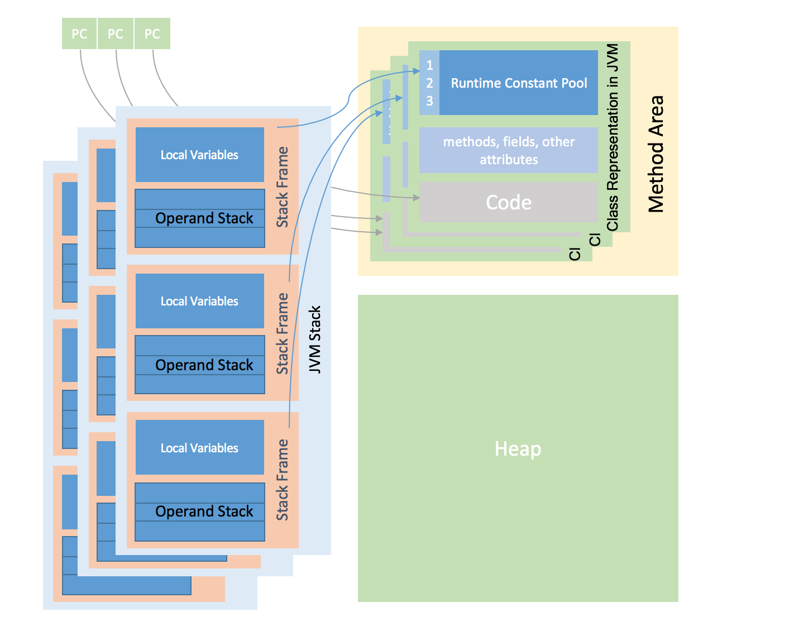

# JVM Structure
## Primitive Types and Values
The primary data types supported by JVM are the `numeric` types, the `boolean` types and `returnAddress` type.

numberic types include integral types and floating-point types:

- byte, 8-bit two's-complement integer
- short, 16-bit two's-complement integer
- int, 32-bit two's-complement integer
- long, 64-bit two's-complement integer
- char, 16-bit unsigned integers representing Unicode code points

float-pointing types:

- float
- double

boolean type: true / false

returnAddress type:
pointer to the opcode of JVM instructions, which is mainly used by `jsr`, `ret` and `jsr_w`.

## Reference Type
There are 3 kinds of reference types: Class type, Array type and Interface types.

Array type has a `component` type.

## Run-time data areas
Some areas are created on JVM start-up and destroyed only when the JVM exits. Other data areas are per thread.

## Representation of Objects
Don't mandate any particular internal structure for objects. It's implementation specific.

## Instruction set
A JVM instruction: a one-byte opcode following zero or more operands.